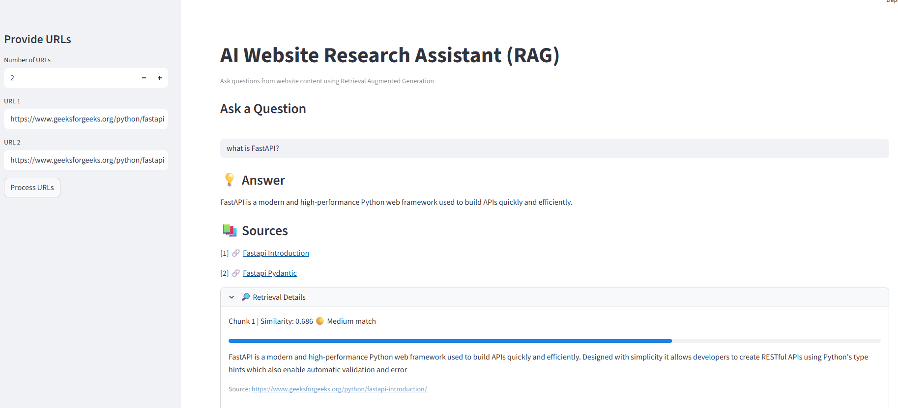

# AI Website Research Assistant (RAG)

An AI-powered application that allows users to ask questions based on the content of one or more websites. The system retrieves relevant information from the provided URLs and generates grounded answers using Retrieval-Augmented Generation (RAG).

## 🚀 Live Demo

Streamlit App: https://rag-website-research-assistant-8nw8r8peq52bdvnj5tmqq4.streamlit.app/

## 📌 Project Overview

The **AI Website Research Assistant** enables users to input multiple website URLs and ask questions about their content. The application extracts webpage data, converts it into embeddings, stores it in a vector database, retrieves relevant chunks, and uses an LLM to generate accurate answers with source references.

This project demonstrates the implementation of **Retrieval-Augmented Generation (RAG)** using modern AI frameworks.

## ✨ Features

* Extracts content from multiple website URLs
* Splits content into manageable chunks
* Converts text into vector embeddings
* Stores embeddings in a vector database
* Retrieves the most relevant content for a user query
* Generates answers using an LLM
* Displays sources and similarity scores for transparency
* Interactive web interface built with Streamlit

## 🧠 Architecture

The application follows a modular architecture:

User Input (URLs + Question)
↓
Website Content Loader
↓
Text Chunking
↓
Embedding Generation
↓
Vector Storage (ChromaDB)
↓
Retriever
↓
LLM Answer Generation
↓
Response with Sources

## 🛠 Tech Stack

**Programming Language**

* Python

**Frameworks & Libraries**

* Streamlit
* LangChain

**Vector Database**

* ChromaDB

**Embeddings**

* Sentence Transformers (HuggingFace)

**LLM**

* Groq

**Web Scraping**

* BeautifulSoup
* Requests

## 📂 Project Structure

```
rag-website-research-assistant
│
├── app.py
├── requirements.txt
│
├── services
│   ├── LoaderService.py
│   ├── ChunkingService.py
│   ├── EmbeddingService.py
│   ├── VectorStoreService.py
│   ├── RetrieverService.py
│   └── GeneratorService.py
│
├── utils
│   └── RAGPipeline.py
│
└── data
```

## ⚙️ Installation

Clone the repository:

```
git clone https://github.com/yourusername/rag-website-research-assistant.git
cd rag-website-research-assistant
```

Create a virtual environment:

```
python -m venv venv
source venv/bin/activate
```

Install dependencies:

```
pip install -r requirements.txt
```

## 🔑 Environment Variables

Create a `.env` file and add your API key:

```
GROQ_API_KEY=your_api_key_here
```

## ▶️ Run the Application

Start the Streamlit app:

```
streamlit run app.py
```

## 📸 Application Screenshot



## 📚 What I Learned

* Implementing Retrieval-Augmented Generation (RAG)
* Working with embeddings and vector databases
* Designing modular AI applications
* Handling dependency compatibility issues
* Deploying AI apps using Streamlit Cloud

## 🔮 Future Improvements

* Support for PDF and document uploads
* Conversation memory
* Improved chunking strategies
* Multiple LLM options
* Authentication for users

## 🤝 Contributing

Contributions are welcome! Feel free to open issues or submit pull requests.

## 📄 License

This project is open source and available under the MIT License.
